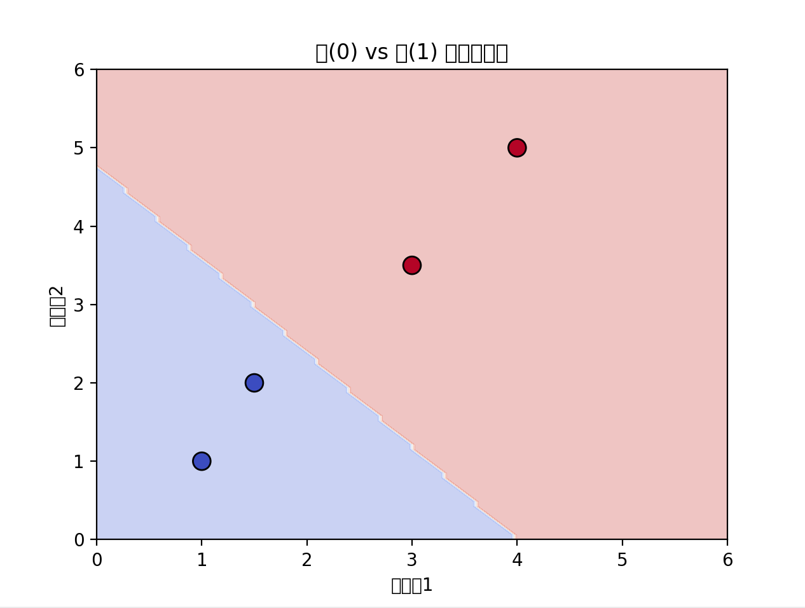

# LLM Tutorial

This repository collects small PyTorch experiments ranging from linear models to miniature Transformer blocks.

## プロジェクト構成
- `llm_tutorial_1/`
  - `learn.py`: 3 次元入力に対する線形回帰タスクを `nn.Linear` + `MSELoss` で学習するデモ。
  - `learn_classify.py`: 犬/猫の特徴量を使った 2 クラス分類。Apple Silicon の MPS バックエンドがあれば自動で利用。
  - `learn_class_decision_boundary.py`: 上記分類器の決定境界をメッシュグリッドで可視化し、`images/learn_class_decision_boundary.png` を生成。
  - `minllm.py`: 変換ブロックを組み合わせた小型 GPT 風モデルを定義し、ランダムトークンに対する出力テンソル形状を確認。
  - `simplenet.py`: 単一の全結合層 + ReLU でランダム入力の流れと追加線形層の重み/バイアスを観察。
- `llm_tutorial_mnist/`
  - `mnist.py`: MNIST データセットを使って手書き数字分類器を学習し、損失と精度をレポート。
- `images/`: チュートリアルの可視化結果を保存するディレクトリ。
- `requirements.txt`: PyTorch トリオと Matplotlib を含む最小構成の依存パッケージ一覧。

## セットアップ
1. 仮想環境を作成して有効化します。
   ```bash
   python3 -m venv venv
   source venv/bin/activate
   ```
2. 依存関係をインストールします。
   ```bash
   pip install -r requirements.txt
   ```

## 実行方法
各スクリプトは自己完結型なので、目的のサブフォルダに移動して `python <script>` を実行するだけで、出力や可視化を再現できます。

### 例
```bash
cd llm_tutorial_1
python learn_classify.py
```


