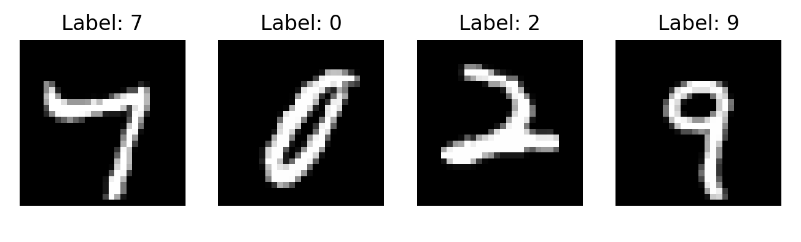

# LLM Tutorial

PyTorch を使った小さな機械学習/LLM 実験をまとめたリポジトリである。線形回帰から簡易的な Transformer ブロックまで、最小限のコードで確認できるサンプル。

## プロジェクト構成
- `01_pytorch_tutorial/`
  - `learn.py`: 3 次元入力に対する線形回帰タスクを `nn.Linear` + `MSELoss` で学習するデモである。
  - `learn_classify.py`: 犬/猫の特徴量を使った 2 クラス分類であり、Apple Silicon の MPS バックエンドがあれば自動で利用する。
  - `learn_class_decision_boundary.py`: 上記分類器の決定境界をメッシュグリッドで可視化し、`images/learn_class_decision_boundary.png` を生成する。
  - `minllm.py`: 変換ブロックを組み合わせた小型 GPT 風モデルを定義し、ランダムトークンに対する出力テンソル形状を確認するスクリプトである。
  - `simplenet.py`: 単一の全結合層 + ReLU でランダム入力の流れと追加線形層の重み/バイアスを観察する。
- `02_pytorch_mnist/`
  - `mnist.py`: MNIST データセットを使って手書き数字分類器を学習し、損失と精度をレポート。
  - `load_and_infer.py`: 学習済み `mnist_mlp.pth` を読み込み、テスト画像の予測ラベルと正解ラベルを並べて可視化。
  - `mnist_dummydata_weightconfirm.py`: ランダム生成したダミーデータで学習を回し、`fc1.weight` の平均値を逐次表示して重み更新を観察。
  - `mnistview.py`: DataLoader から取り出した 4 枚の手書き数字を並べて表示。
  - `mnistview100.py`: テストデータセット先頭 100 枚を 10×10 グリッドに並べて一括表示。
- `images/`: チュートリアルの可視化結果を保存するディレクトリ。
- `requirements.txt`: PyTorch と Matplotlib を含む最小構成の依存パッケージ一覧である。

## セットアップ
1. 仮想環境を作成して有効化する。
   ```bash
   python3 -m venv venv
   source venv/bin/activate
   ```
2. 依存関係をインストールする。
   ```bash
   pip install -r requirements.txt
   ```

## 実行方法
各スクリプトは自己完結型であるため、目的のサブフォルダに移動して `python <script>` を実行するだけで、出力や可視化を再現できる。

### 実行例1
```bash
cd 01_pytorch_tutorial
python learn_class_decision_boundary.py
```


### 実行例2 MNISTを４枚表示する
```bash
cd 02_pytorch_mnist
python mnistview.py
```


### 実行例3 MNISTを学習済モデルで認識する
```bash
cd 02_pytorch_mnist
python load_and_infer.py
```

`load_and_infer.py` は引数を受け取って表示対象やモデルを切り替えられる。例として、次のように実行できる。

```bash
python load_and_infer.py -s 0 -n 10 -w mnist_cnn.pth -m cnn
```

- `-s` / `--start-index`: 推論を開始するテストデータのインデックスを指定する引数である。
- `-n` / `--count`: 表示する画像枚数を指定する引数である。
- `-w` / `--weights`: 読み込む学習済み重みファイルのパスを指定する引数である。
- `-m` / `--model-type`: 使用するモデルの種類を `mlp` か `cnn` から選択する引数である。


## `nn.Linear` メモ
`nn.Linear` は入力ベクトルに対して線形変換（全結合層）を適用する層である。パラメータは学習によって更新され、非線形活性化関数と組み合わせることで多層パーセプトロンなどを構成できる。

```python
layer = nn.Linear(in_features, out_features)
```

- `in_features`: 入力の次元数
- `out_features`: 出力の次元数
- 出力テンソルは \(y = xW^T + b\) で計算される。

MNIST 例では次のように使用している。

```python
self.fc1 = nn.Linear(28 * 28, 100)
self.fc2 = nn.Linear(100, 10)
```

1. 画像 (28×28) を 784 次元ベクトルにフラット化
2. `fc1` で特徴抽出（784 → 100）
3. ReLU で非線形性を付与
4. `fc2` でクラスごとのロジット（100 → 10）を計算

`fc1.weight`, `fc1.bias`, `fc2.weight`, `fc2.bias` は誤差逆伝播によって自動的に更新される。`torch.softmax` を用いればロジットを確率として解釈できる。


## CNN メモ

```
画像 (28x28)
↓
Conv1 → 線・角を検出
↓
Conv2 → 複雑な形を検出
↓
Flatten → 特徴を並べる
↓
Linear1 → 意味を抽象化
↓
Linear2 → クラス（数字0〜9）を出力
```

| 処理段階        | 入力 → 出力サイズ            | 主な役割  | 説明                                         |
| :-------------- | :--------------------------- | :-------- | :------------------------------------------- |
| **① 畳み込み1** | `1×28×28 → 32×28×28`         | 特徴抽出  | 1枚の白黒画像を32枚の「特徴マップ」に変換。線・角・端などを検出。         |
| **ReLU**        | `32×28×28 → 32×28×28`        | 非線形化  | 負の値を0にして、反応の強い部分だけを残す。特徴を強調。               |
| **② MaxPool**   | `32×28×28 → 32×14×14`        | 圧縮・要約 | 2×2の中で最大値を取る。画像サイズを1/2にし、特徴を要約。位置ズレにも強くなる。 |
| **③ 畳み込み2** | `32×14×14 → 64×14×14`        | 複雑な特徴抽出 | 前の層の情報（線や角）を組み合わせ、より複雑な形（輪郭・部分構造）を学ぶ。      |
| **ReLU**        | `64×14×14 → 64×14×14`        | 非線形化  | 特徴の反応を強調。ノイズを抑える。                          |
| **④ MaxPool**   | `64×14×14 → 64×7×7`          | 圧縮・要約 | 最終的な特徴の要約。次の「分類器」部分に渡すための準備。               |

| 項目    | 内容                                                     |
| :------ | :-------------------------------------------------------- |
| 学習対象  | Conv2d のフィルター（重み + バイアス）                               |
| 数     | (in_channels × kernel_h × kernel_w + 1) × out_channels |
| 学習方法  | 逆伝播（Backpropagation）で更新                                |
| 学習の意味 | 各フィルターが有用な特徴（線・角・形）を自動で検出できるように進化                      |

nn.Conv2d(1, 32, kernel_size=3, padding=1),の場合、  
１枚の画像(28x28x1) (28x28x32)にする。32チャネルは３x３のフィルター（カーネル）=行列 で計算される。

```text
３x３のフィルター（カーネル）  =
 [[-1, -1, -1],
  [ 0,  0,  0],
  [ 1,  1,  1]]
```

各フィルターは：
サイズ：3×3
入力チャンネル：1
なので、1つのフィルターの重みは
→ 1 × 3 × 3 = 9個の重み ＋ 1個のバイアス = 10パラメータ
これを32チャネル分算出するため、TOTAL320パラメータ。

```text
入力画像 (1×28×28)
        │
        ├─ フィルター #1 → 特徴マップ #1（縦線検出）
        ├─ フィルター #2 → 特徴マップ #2（横線検出）
        ├─ フィルター #3 → 特徴マップ #3（斜め検出）
        ├─ ...
        └─ フィルター #32 → 特徴マップ #32（他のパターン）
↓ すべてまとめて出力
出力: 32 × 28 × 28
```

Conv2dは 「画像を、複数の“意味ある特徴”に分解する層」
そのための“見方”を学ぶのが フィルターの学習。

## CNN全体の後半：分類部（classifier）

| 段階                   | 入力 → 出力の形状 | 処理の内容            | 役割・説明                                                 |
| :--------------------- | :--------------- | :-------------------- | :--------------------------------------------------------- |
| **① Flatten**          | `64×7×7 → 3136`  | 2Dデータを1次元ベクトルに変換 | CNNで抽出した64枚の特徴マップを1本の長いベクトルに並べる。<br>→ 全結合層へ入力できる形にする。 |
| **② Linear(3136→128)** | `3136 → 128`     | 全結合層（重み行列との掛け算）  | 画像全体の特徴を128次元に圧縮。重要な特徴だけを残し、次段に渡す。                    |
| **③ ReLU**             | `128 → 128`      | 活性化関数（非線形変換）     | 負の値を0にして、重要な特徴を強調。学習を安定化させる。                          |
| **④ Linear(128→10)**   | `128 → 10`       | 出力層（全結合）         | 最終出力。10クラス（数字 0〜9）それぞれのスコア（確率前）を出力。                   |


## Train
| ステップ | 処理                               | 主な役割               |
| ---- | -------------------------------- | ------------------ |
| 1  | `output = model(data)`           | 順伝播（予測）            |
| 2  | `loss = loss_fn(output, target)` | 損失計算（誤差の見える化）      |
| 3  | `loss.backward()`                | 勾配計算（どの方向に修正すべきか）  |
| 4  | `optimizer.step()`               | パラメータ更新（実際に重みを変える） |
| 5  | `optimizer.zero_grad()`          | 勾配の初期化（次バッチに備える）   |
